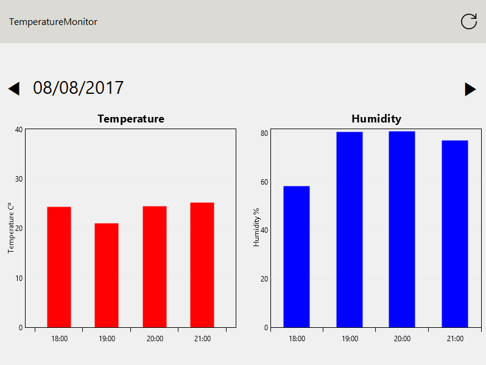
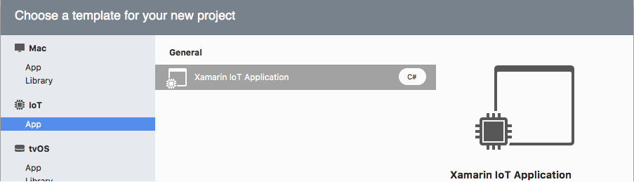
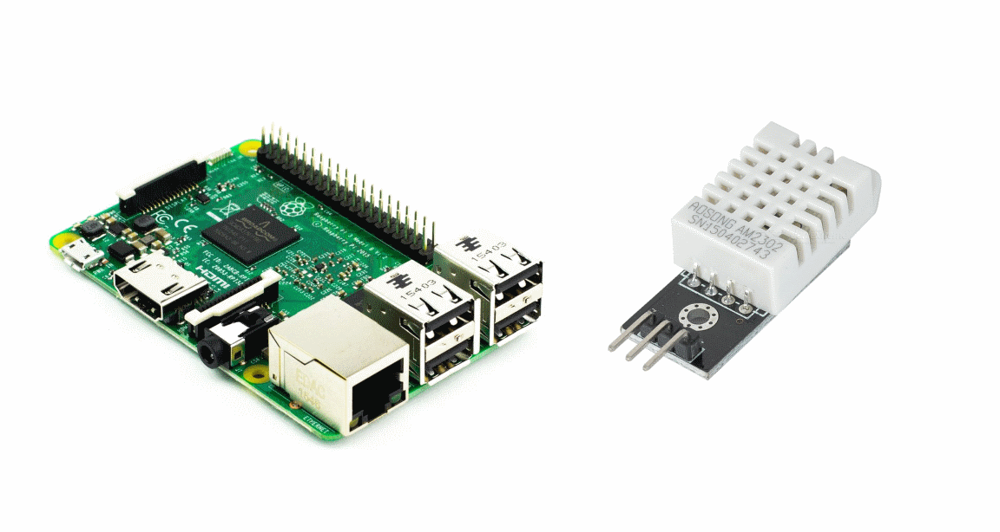

# Temperarute Monitor App (Xamarin IoT + Xamarin.Forms GTK Backend)

The Temperature Monitor App is a **Xamarin.Forms** GTK Backend App running on **Linux** that reads temperature and humidity sensor data.

The App uploads data to **Azure Table Storage**. In Azure there are also a **Net Core Web API** that returns the data to the App, to show results in the most visual form.
Using **Oxyplot** charts the App shows the summary of temperatures and humidities per hour each day.

Xamarin.Forms, .NET Core, Linux on server and client, sounds interesting?.

## Xamarin IoT

[Xamarin.IoT](https://developer.xamarin.com/guides/cross-platform/iot/) enables developers to write and share C# code across devices, now including internet of things devices such as Raspberry Pi and Intel Edison. It works with any IoT device running Linux (most popular distributions) and integrates seamlessly with the Azure IoT Suite to connect, analyze, and secure your IoT solutions.

You can use MQTT and AMPQ with your Xamarin.IoT projects by just adding a reference to the corresponding packages.

## Xamarin.Forms

[Xamarin.Forms](https://www.xamarin.com/forms) allows you to build native UIs for **iOS, Android, Windows, MacOS and Linux** from a single, shared codebase. You can dive into mobile development with Xamarin.Forms by following our free self-guided learning from Xamarin University. This project exercises the following patterns and features:

- Xamarin.Forms
- XAML UI
- Converters
- Custom Renderers
- Data Binding
- IoC
- MVVM
- Styles

## Prerequisites

- A **Raspberry Pi** 3 running Raspbian with Mono and GTK#.
- Humidity Sensor **DHT22**.
- **Visual Studio** 2017 (Windows or Mac) Community Edition and above.
- **Azure** subscription. Not a Visual Studio subscriber? Get a $25 monthly Azure credit by joining [Visual Studio Dev Essentials](https://www.visualstudio.com/products/visual-studio-dev-essentials-vs).

## Xamarin.Forms 3.0 Feed

The **Xamarin.Forms 3.0** preview is published to a custom NuGet feed. To get it:

- Add a new source to your NuGet Manager: [https://www.myget.org/F/xamarinforms-dev/api/v3/index.json](https://www.myget.org/F/xamarinforms-dev/api/v3/index.json).
- Check Pre-Release.
- Select and install the package with the  name **3.0.0.201-gtk**.

## How to try?

The class **AppSettings** has important configurations to add:

- **StorageConnectionString**: Connection string to the Azure Storage.
- **ApiUrl**: Base URL of the API deployed onto the App Service.

Enjoy!.

## Feedback

Please use [GitHub issues](https://github.com/jsuarezruiz/xamarin-forms-gtk-iot-samples/issues) for questions and comments.

## License

Code released under the [MIT license](https://opensource.org/licenses/MIT).
